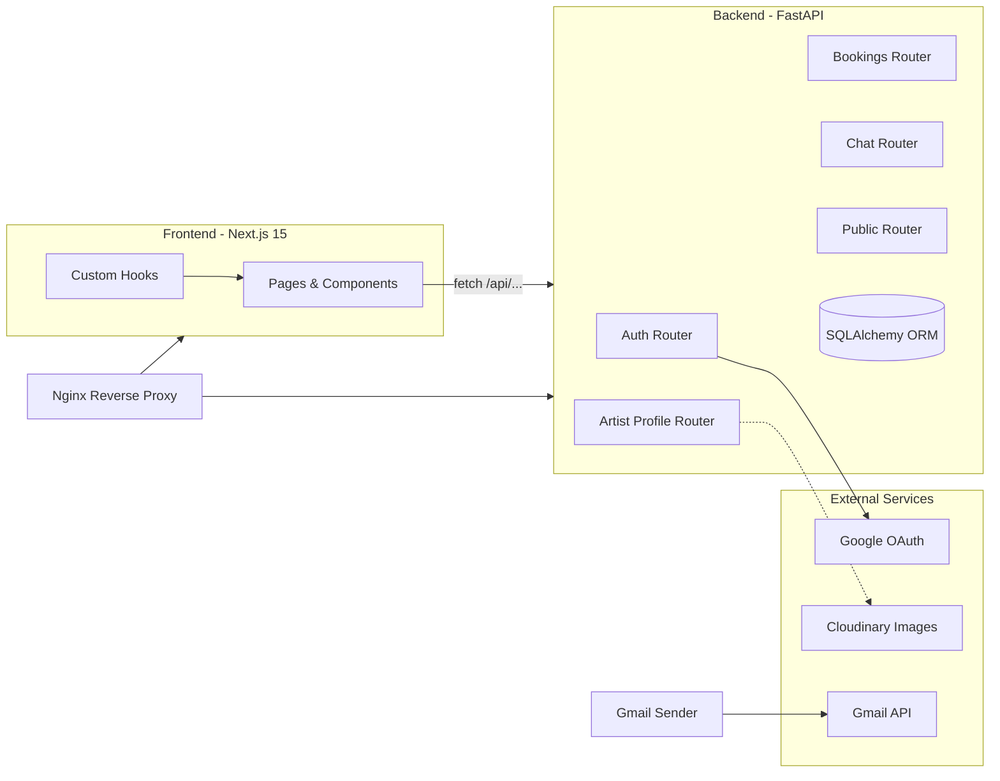
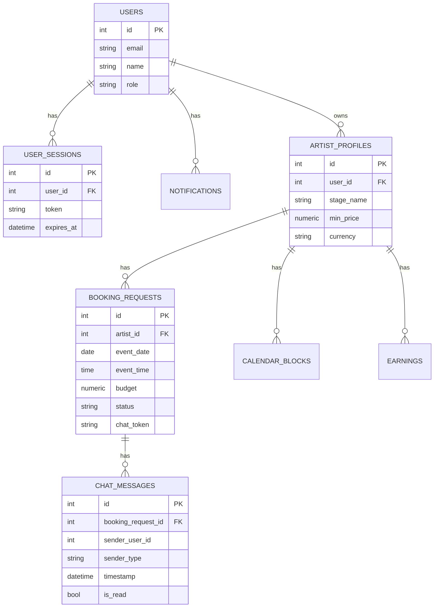

### תקציר מנהלים (Executive Summary)
הפרויקט "DORON" הוא מערכת דו-רכיבית לניהול הזמנות אמנים וצ'אט לקוחות:
- Backend: FastAPI + SQLAlchemy, בסיס נתונים SQLite כברירת מחדל, OAuth של Google, שליחת PDF במייל דרך Gmail API, ויצירת PDF עם WeasyPrint.
- Frontend: Next.js 15 (App Router) + React 19 + TypeScript, עמודי Dashboard/Artist/Booking/Chat, העלאת תמונות ל-Cloudinary.

מצב כללי: MVP פעיל עם מודולים עיקריים (אימות, פרופיל אמן, הזמנות, צ'אט, ציבורי). קיימות נקודות לחיזוק באבטחה (Cookie flags/CSRF/CORS), תצפיתיות, ופריסות פרודקשן. איכות הקוד טובה יחסית ומודולרית, אך יש הדפסות/console.log בייצור, TODOs, ו־echo SQL מופעל.


### מטריקות מפתח (טבלה)
| מדד | ערך |
|---|---|
| שפות | Python, TypeScript/TSX, Nginx conf, HTML/Jinja |
| פריימוורקים | FastAPI, SQLAlchemy, Next.js 15, React 19 |
| מודולים Backend פעילים | auth, profile, bookings, chat, public |
| ישויות DB | 7 (User, UserSession, ArtistProfile, BookingRequest, ChatMessage, CalendarBlock, Earning, Notification) |
| אינדקסים ידניים | ix_chat_messages_booking_ts, שדות index בטבלאות |
| Endpoints מרכזיים | ~15 (אימות, פרופיל, הזמנות, צ'אט, ציבורי) |
| סוג אימות | JWT ב־HttpOnly Cookie (OAuth Google) |
| תלותי חוץ | Google OAuth, Gmail API, Cloudinary |
| בדיקות | ללא בדיקות אוטומטיות מזוהות |
| CI/CD | לא קיים בריפו |


### מיפוי ארכיטקטורה (עם Mermaid)



### דפוסי תלויות ומודולריות
- Backend מחולק לפי Routers: `app/api/{auth,profile,bookings,chat,public}.py` עם תלות משותפת ב־`app/core/db.py` ו־`app/models/models.py`.
- Frontend בנוי לפי עמודים ב־`src/app/**` ורכיבים ב־`src/components/**`, עם Hooks ב־`src/app/hooks/**` המבודדים קריאות API וניהול סטייט.
- הפרדת אחריות טובה; שכבת DB מרוכזת, ו־Schemas ב־Pydantic מגדירים חוזי API.


### איכות קוד ו‑Maintainability
- קריאות גבוהה, טיפוסיות TypeScript בצד הלקוח, Pydantic בצד השרת.
- קיימים מספר TODOs בקובץ ההזמנות להעברת ולידציה לצד לקוח – יש להשאיר ולידציה גם בשרת (שיקולי אבטחה/אמינות).
- שימוש ב־`print`/`console.log` ו־`logging.basicConfig(level=INFO)` בפרודקשן – מומלץ לרכז ללוגר אחיד עם רמות ולהסיר הדפסות.
- `echo=True` למנוע SQL ב־prod – יש לכבות.


### ביצועים
- ORM: שימוש ב־`joinedload` בנקודות הנכונות. יש אינדקס על `chat_messages` (booking_id,timestamp).
- ברירת מחדל SQLite עם WAL ו־busy_timeout – טוב ל־dev, לא לפרודקשן/תחרותיות גבוהה.
- שליחת PDF עם WeasyPrint – ייתכן כבד; שקלו תור/Job async או cache.


### אבטחה
- JWT ב־HttpOnly Cookie, `samesite="lax"`. ב־/callback מוגדר `secure=False` (dev), אבל ב־logout מחיקה עם `secure=True` – חוסר עקביות.
- CORS: מוגדר ALLOWED_ORIGINS אך נעשה שימוש ברשימה קשיחה. מומלץ לטעון מה־ENV ולהחמיר ב־prod.
- CSRF: פעולות State-changing משתמשות ב־Cookie – יש לשקול הגנת CSRF (Double Submit/CSRF header + SameSite=Strict).
- סודות: נקראים מה־ENV; אין דליפה בקוד, אך יש console.log/print המודפסים (PII פוטנציאלי).
- Nginx: CSP עם `'unsafe-inline'/'unsafe-eval'` – מומלץ לצמצם לפני פרודקשן.


### תצפיתיות (Observability)
- לוגים בסיסיים; אין מטריקות/Tracing. מומלץ להוסיף OpenTelemetry/Prometheus metrics ולוגר מובנה (JSON) עם מזהי בקשות.


### בדיקות ו‑CI/CD
- לא נמצאו בדיקות יחידה/אינטגרציה או Workflow של CI.
- מומלץ להוסיף: pytest ל־backend, Playwright/RTL ל־frontend, ו־GitHub Actions להרצה אוטומטית.


### תשתיות ו‑Deployments
- Nginx קיים עם קשיחות אבטחה טובה. חסר Dockerfile/Compose לפריסה ידידותית.
- ENV: שימוש ב־dotenv ל־dev. מומלץ תצורות per-env.


### UX/Frontend
- UI מודרני, חלוקה נאה ל־Sections ו־Hooks. אין i18n; קיימת עברית/אנגלית מעורבת.
- העלאת תמונות דרך Cloudinary – בדיקות סוג/גודל קיימות.


### נתונים/DB ו‑Schemas (עם ERD)



### סיכונים וציות (Compliance)
- PII (אימייל/שם/טלפון) – לשקף במדיניות פרטיות, מסגור לוגים ללא PII, ושמירת נתונים מוגבלת זמן.
- שמירת לוגים: אין מדיניות Retention. מומלץ 30–90 יום ל־app logs.
- תלותי חוץ: Google/Gmail/Cloudinary – לוודא הסכמי שימוש והגבלות נתונים.


### ממצאים ממוספרים (עם קישורים לנתיב:שורה)
1. F-001: חוסר עקביות דגלי Cookie (מחיקה לא תתפוס ב־dev)
   - חומרה: 3, השפעה: Logout תקול/נשארת Session; מאמץ: S; אמון: High
```100:109:backend/app/api/auth.py
    redirect_response.set_cookie(
        key="access_token",
        value=access_token_jwt,
        max_age=3600,
        httponly=True,
        secure=False,  # dev
        samesite="lax"
    )
```
```146:151:backend/app/api/auth.py
    response.delete_cookie(
        key="access_token",
        httponly=True,
        secure=True,
        samesite="lax"
    )
```

2. F-002: שימוש ב־SECRET_KEY ללא בדיקת קיום
   - חומרה: 3; השפעה: כשלי JWT/אבטחה; מאמץ: S; אמון: High
```16:21:backend/app/api/auth.py
SECRET_KEY = os.getenv("JWT_SECRET_KEY")
ALGORITHM = "HS256"
ACCESS_TOKEN_EXPIRE_MINUTES = 60
```

3. F-003: CORS מוקשח ידנית ולא לפי ENV
   - חומרה: 2; השפעה: קונפיג שגוי בפרוד; מאמץ: S; אמון: High
```33:41:backend/app/main.py
ALLOWED_ORIGINS = os.getenv("ALLOWED_ORIGINS", "http://localhost:3000,http://localhost:8000").split(",")
app.add_middleware(
    CORSMiddleware,
    allow_origins=["http://localhost:3000", "http://localhost:8000"],
    allow_credentials=True,
    allow_methods=["GET","POST","PUT","DELETE","OPTIONS"],
    allow_headers=["Content-Type","Authorization"],
)
```

4. F-004: `echo=True` למנוע SQL בפרודקשן
   - חומרה: 2; השפעה: זליגת מידע/ביצועים; מאמץ: S; אמון: High
```24:30:backend/app/core/db.py
engine = create_engine(
    DATABASE_URL,
    connect_args=sqlite_connect_args,
    pool_pre_ping=True,
    echo=True,  # ב-prod כדאי False
    future=True
)
```

5. F-005: הדפסות Debug/PII במספר נקודות
   - חומרה: 2; השפעה: חשיפת PII/רעש; מאמץ: S; אמון: High
```35:47:backend/app/api/auth.py
@router.get("/google/login")
def google_login():
    print(f"Google login")
```
```144:159:backend/app/api/bookings.py
        if booking_data.client_message:
            print("***************************************************")
            ...
            print(response)
```

6. F-006: העדר הגנת CSRF בפעולות עם Cookie Auth
   - חומרה: 4; השפעה: התקפות CSRF; מאמץ: M; אמון: Medium

7. F-007: CSP ב-Nginx כולל 'unsafe-inline'/'unsafe-eval'
   - חומרה: 3; השפעה: הורדת קשיחות XSS; מאמץ: M; אמון: High
```36:43:nginx.conf
add_header Content-Security-Policy "default-src 'self'; script-src 'self' 'unsafe-inline' 'unsafe-eval' https://accounts.google.com https://apis.google.com; ...";
```

8. F-008: ברירת מחדל SQLite בפרוד
   - חומרה: 3; השפעה: תחרותיות/סקייל; מאמץ: M; אמון: High

9. F-009: TODOs להעברת ולידציה ל־Frontend
   - חומרה: 2; השפעה: סיכון אם יוסר צד שרת; מאמץ: S; אמון: High
```28:36:backend/app/api/bookings.py
##TODO -- MOVE THE VALIDATION TO THE FRONTEND
# Check if event date is in the future
```


### המלצות קונקרטיות (עם קטעי קוד מוצעים)
- תיקון Cookie flags עקביים:
```python
# backend/app/api/auth.py
cookie_secure = os.getenv("COOKIE_SECURE", "false").lower() == "true"
cookie_samesite = os.getenv("COOKIE_SAMESITE", "lax")
redirect_response.set_cookie(
    key="access_token", value=access_token_jwt, max_age=3600,
    httponly=True, secure=cookie_secure, samesite=cookie_samesite
)

response.delete_cookie(
    key="access_token", httponly=True, secure=cookie_secure, samesite=cookie_samesite
)
```
- CORS לפי ENV:
```python
# backend/app/main.py
allowed = ALLOWED_ORIGINS
app.add_middleware(CORSMiddleware, allow_origins=allowed, allow_credentials=True,
                   allow_methods=["GET","POST","PUT","DELETE","OPTIONS"],
                   allow_headers=["Content-Type","Authorization"]) 
```
- כיבוי echo והחלפת DB לפרוד:
```python
# backend/app/core/db.py
echo_flag = os.getenv("SQL_ECHO", "false").lower() == "true"
engine = create_engine(DATABASE_URL, connect_args=sqlite_connect_args, pool_pre_ping=True, echo=echo_flag, future=True)
```
- CSRF: הוספת כותרת מותאמת ובדיקה צד שרת, או מעבר ל־Authorization Bearer במקום Cookie עבור REST.
- ניקוי לוגים/prints והחלפתם בלוגר עם רמות.
- Nginx CSP ללא 'unsafe-*' בפרוד.


### פריוריטיזציה (טבלת Impact/Effort/Confidence)
| ID | Impact | Effort | Confidence |
|---|---:|:---:|:---:|
| F-006 (CSRF) | 5 | M | Medium |
| F-001 (Cookie flags) | 4 | S | High |
| F-003 (CORS via ENV) | 3 | S | High |
| F-004 (SQL echo) | 2 | S | High |
| F-007 (CSP) | 3 | M | High |
| F-008 (DB Prod) | 4 | M | High |
| F-005 (Logs) | 2 | S | High |


### Roadmap 30/60/90
- 0–2 שבועות:
  - להחמיר Cookie/CORS/CSRF; להסיר הדפסות; לכבות SQL echo; להגדיר ENV לפרוד. בעלים: Backend.
  - להוסיף בדיקות יחידה לשכבת Schemas/Routes קריטיים. בעלים: Backend.
- 30 יום:
  - אינסטרומנטציה (OTel/metrics), CI (GitHub Actions), Docker Compose (db+api+web), CSP מוקשה. בעלים: DevOps.
  - i18n בסיסי ב־Frontend; הסרת console.log. בעלים: Frontend.
- 60 יום:
  - מעבר DB ל־PostgreSQL, מיגרציות Alembic, אינדקסים משלימים. בעלים: Backend/DBA.
  - Queues ל־PDF/Mail (RQ/Celery) והפרדת עבודה כבדה. בעלים: Backend.
- 90 יום:
  - e2e (Playwright) ופייפליין CD; מעקב SLA והתראות. בעלים: DevOps.


### שאלות פתוחות והנחות עבודה
- האם ה־Backend אמור לתמוך בריבוי דומיינים (ALLOWED_ORIGINS)?
- האם תידרש הפרדה בין לקוח (booker) ללא חשבון לבין artist? כיום chat_token מאפשר גישה מזוהה.
- אילו זמני Retention נדרשים עבור PII ו־logs?


### מילון מונחים (Glossary)
- CSRF – Cross-Site Request Forgery.
- CSP – Content Security Policy.
- OTel – OpenTelemetry.
- WAL – Write-Ahead Logging (SQLite).


### נספחים: אינדקס קבצים נסרקים, רשימת TODO/FIXME, קבצים שדולגו
- אינדקס קבצים עיקריים שנסרקו: `backend/app/main.py`, `backend/app/api/{auth,profile,bookings,chat,public}.py`, `backend/app/core/db.py`, `backend/app/models/models.py`, `backend/app/schemas/auth.py`, `frontend/src/app/**`, `frontend/src/components/**`, `frontend/package.json`, `frontend/next.config.ts`, `nginx.conf`.
- TODO/FIXME:
  - `backend/app/api/bookings.py`: שורות 28, 52, 66 – "MOVE THE VALIDATION TO THE FRONTEND".
  - `backend/app/main.py`: שורות 13–18 – TODO לראוטרים עתידיים.
- קבצים שדולגו (גדולים/בינאריים/תלויות):
  - `backend/app/assest/booking_summary_*.pdf` (בינארי, נוצר דינמית).
  - `frontend/package-lock.json` (מניפסט תלות בלבד).


